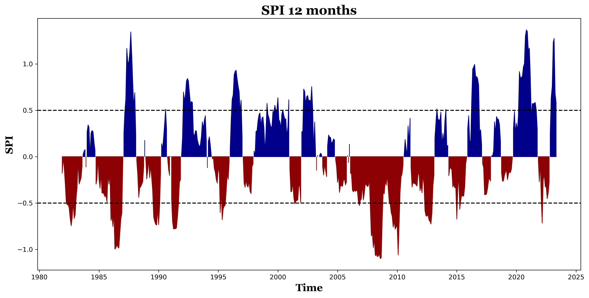

# SPI-Function
The drought will be identified through the calculation using the *Standardized Precipitation Index* (SPI). 

# SPI
[Mckee, 1993](https://api.semanticscholar.org/CorpusID:129950974) proposed this index for identifying droughts. The SPI requires accumulated precipitation data for a minimum of 30 years. The index has three scales: meteorological, agricultural, and hydrological (3 months, 6 months, and 12 months).

  

# References

McKee, T.B., Doesken, N.J., Kleist, J., 1993. THE RELATIONSHIP OF DROUGHT FREQUENCY AND DURATION TO TIME SCALES 6.
Url: https://api.semanticscholar.org/CorpusID:129950974
